# auto-mcp-server

You've got a web app with a REST API. Maybe it's a Django app and you've generated an OpenAPI spec using `drf-spectacular`. 

Now you want to let an LLM talk to it. You need an MCP server to handle the translation between the two.

```mermaid
graph LR
    A[🤖 LLM] <--> B[🔌 MCP Server] <--> C[🌐 API Server]
```



`auto-mcp-server` is a lightweight MCP server that makes your Web App accessible by LLMs. It was originally made for https://syracuse.1145.am but could be used for any server that has an OpenAPI spec. Not sure how good it would be for heavy production use, but it's certainly good enough for getting started.

It comes in two flavours:
1. A local MCP server that uses STDIO and can work with e.g. the free tier of Claude Desktop
2. A remote MCP server that uses Streamable HTTP and can be deployed on any web host to your liking. It's not really doing any streaming, but that's ok if you're just dealing with individual REST API calls.

## Using this repo

1. Clone it
2. Ensure you have `uv` installed (see https://docs.astral.sh/uv/getting-started/installation/)
3. Copy `.env.sample` to `.env` and configure according to your settings
4. Test with MCP Inspector `npx @modelcontextprotocol/inspector` (see https://modelcontextprotocol.io/legacy/tools/inspector)

## Local MCP Server (STDIO)

With a local MCP server you don't have to start it, you just have to configure your client app (e.g. Claude Desktop) to know where to find the code. Here is a sample `claude_desktop_config.json`

```
{
  "mcpServers": {
    "Your app name": {
      "command": "/path/to/uv",
      "args": [
        "--directory",
        "/path/to/auto-mcp-server",
        "run",
        "stdio_mcp_server.py"
      ]
    }
  }
}
```

Connection info for MCP Inspector:
- **Transport Type**: STDIO
- **Command**: `/path/to/uv`
- **Arguments**: `--directory /path/to/auto-mcp-server run stdio_mcp_server.py`


## Remote MCP Server (Stateless Streaming HTTP)

This needs to be started before MCP Inspector can connect to it. Start it with:

`uv run stateless_streaming_http_mcp_server.py`

Connection info for MCP Inspector:
- **Transport Type**: Streamable HTTP
- **URL**: host:port/mcp, e.g. `http://127.0.0.1:9000/mcp`
- Anyone making calls that require authorization will need to add their API key in the Authentication section

The Stateless Streaming MCP Server also serves an mcp.json at `.well-known/mcp.json` (in this example it would be `http://127.0.0.1/.well-known/mcp.json` )